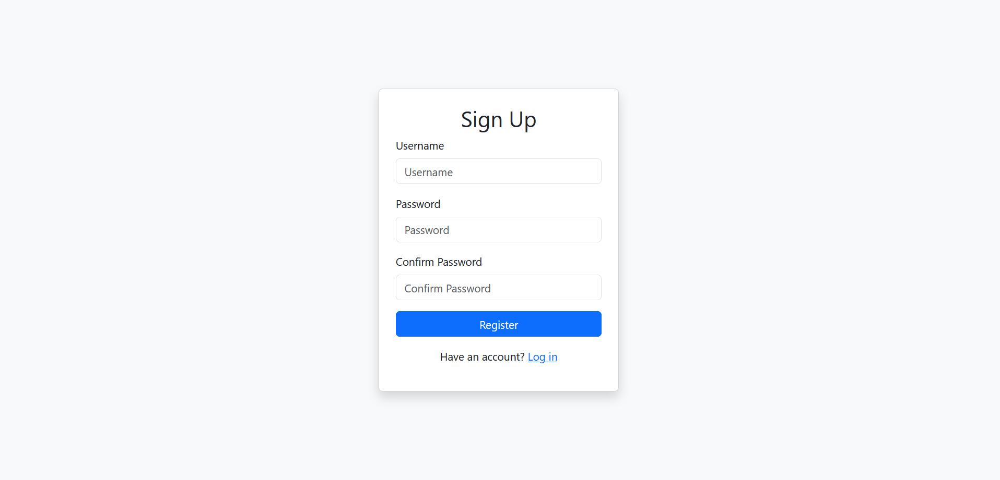

# Fitness Tracker 

## **Why I Built This**
I created this **Fitness Tracker** to explore new technologies while working on something I’m passionate about—fitness. As a fitness fanatic, I wanted a project that would not only improve my programming and application development skills but also allow me to experiment with features I wish existed in popular fitness apps today.

Throughout this project, I’ve gained experience in:

    User authentication & form validation
    Database synchronization with SQLite & Flask
    Front-end design using Bootstrap
    Integrating various Python packages in Flask

This project serves as both a learning experience and a tool that I can continue expanding with new features over time. 🚀

--

A **Flask-based Fitness Tracker** that allows users to register, log in, and track their workouts. Workout tracker metrics include
**sets, reps, weights, and RPE**. The project uses **Bootstrap 5** for UI styling.

---

## Here are some screenshots of the application

### **Login Page**

### **Sign Up Page**

### **Dashboard**

---

## ⚡ Technologies Used
- **Flask** (Backend)
- **Flask-WTF** (Form Handling)
- **Flask-Login** (User Authentication)
- **SQLite** (Database)
- **Bootstrap 5** (Frontend)
- **Jinja2** (Templating)

---