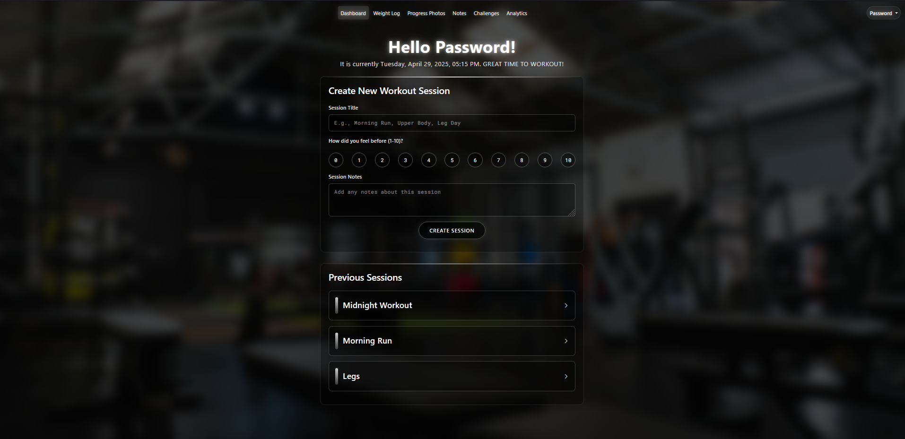
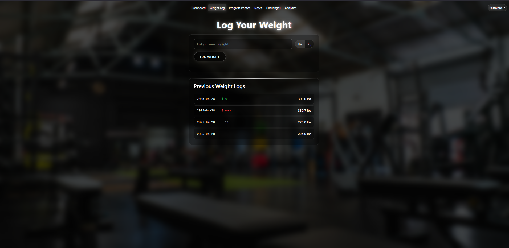
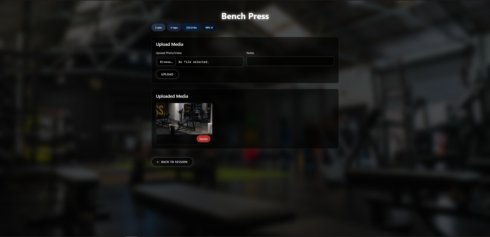
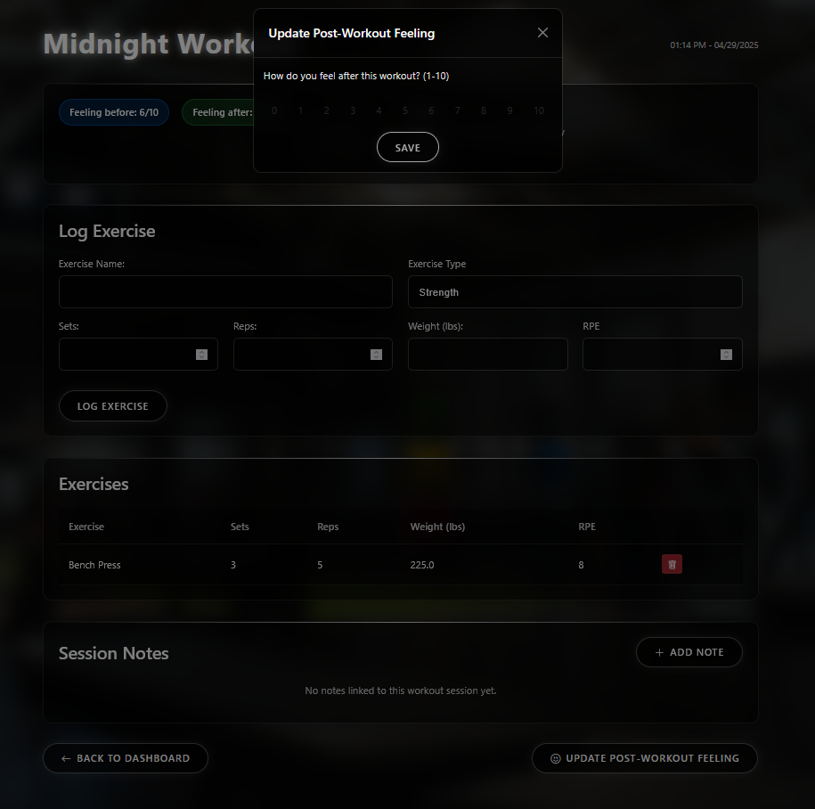

# Fitness Tracker


Access: https://fitness-tracker-ezp6.onrender.com

## **About**
I built this project in my second year of university to further develop my programming skills while combining my passion for fitness. During my high school co-op at Apple in 2021, I created a similar fitness app using Xcode and Swift. Since then, I have gained significant experience and wanted to challenge myself by building a full-stack application from scratch. In the future, I hope to revisit this project and deploy a mobile version to the App Store.

While this is a full-stack, web-based application, my primary focus was on backend development and data management. I integrated Supabase as the backend service, enabling secure cloud-based storage for both user data and media uploads. This structure ensures that all content is efficiently organized and scalable for future enhancements.

## Here are some screenshots of the application

### **Home Page**

The updated home page offers a more professional yet minimalist appearance. It provides a clear overview of the app’s core features, helping users quickly understand its purpose. Login and Register buttons are prominently displayed, guiding users to seamlessly begin using the application.

### **Sign Up Page**

The updated Sign Up page maintains a clean, minimalist design consistent with the overall app theme. Set against a fitness-inspired background, the form is simple and intuitive, allowing users to easily create an account with minimal distractions. Clear input fields and a prominent Register button streamline the onboarding process, helping users get started quickly.

### **Login Page**

The updated Login page continues the minimalist and professional theme, providing users with a clean and focused experience. Set against the same fitness background, the form ensures easy access for returning users. Clear input fields and a bold Login button make the process straightforward, reducing friction for users resuming their fitness tracking journey.

### **Dashboard**

The updated Dashboard provides users with a streamlined experience to log and track their workout sessions. The welcoming header and real-time date and time create a personalized feel, while the minimalist session creation form allows users to quickly input workout details and rate their session. Below, previous sessions are displayed in a clean, expandable format for easy access and review, enhancing both usability and long-term tracking.

### **Creating a new Session**

The Create Session page allows users to quickly log a new workout with a custom title, mood rating (1–10), and optional session notes. The intuitive circular rating selector and clean input fields make the logging process fast and engaging. Once submitted, the session appears in the "Previous Sessions" section below, ensuring users can easily monitor and reflect on past workouts in a visually consistent and accessible layout.

### **Editing Exercises within a session**

The Editing Session page offers users a detailed view of a specific workout session, with options to update their initial and post-workout mood ratings, edit session notes, and log individual exercises. The form allows users to input exercise name, sets, reps, weight, and RPE (Rate of Perceived Exertion), which are displayed in a structured table below for easy tracking. This layout promotes quick edits and ongoing progress monitoring, making the session page both functional and user-friendly.

### **Uploading media to specific exercises within a session**


### **Logging your weight**

The Weight Log page provides users with a simple and efficient way to track their weight over time. Users can quickly input their weight in pounds or kilograms, while previous entries are neatly displayed below, including color-coded indicators for changes. This clean, organized layout helps users easily monitor their progress and stay motivated toward their fitness goals.

### **Uploading media specific to an exercise**

The Exercise Media Upload page allows users to attach visual content to individual exercises, enhancing workout logs with photos or videos. Key exercise metrics—sets, reps, weight, and RPE—are displayed at the top for quick reference. Users can upload media alongside notes for context, and all uploaded content is neatly previewed with options to manage or delete files. This feature supports visual tracking of progress and form, making workouts more interactive and personalized.

### **Updating how you feel post worokuts**

This modal allows users to rate how they felt after completing a workout session on a scale from 1 to 10. It promotes reflection and helps track trends in energy, motivation, or recovery over time, adding a personalized and mindful touch to workout logging.

### **Deleting media within exercises**

---

## ⚡ Technologies Used
- **Flask** (Backend Framework)
- **Flask-WTF** (Form Handling and Validation)
- **Flask-Login** (User Authentication and Session Management)
- **Supabase** (PostgreSQL Database and Cloud Storage)
- **SQLAlchemy** (ORM for Database Interactions)
- **Bootstrap 5** (Frontend Styling)
- **Jinja2** (HTML Templating Engine)
- **Chart.js** (Data Visualization)
- **Render** (Deployment Platform)

## Installation and Setup 
1. Clone the repository

    ```bash
    git clone https://github.com/emaadq/Fitness-Tracker.git
    ```

2. Go to the repository

    ```bash
    cd Fitness-Tracker
    ```

3. Create and activate a virtual environment

    ```bash
    python -m venv venv
    ```

    If you are on Windows, use:

    ```bash
    venv\Scripts\activate
    ```

    If you are on MacOS, use:

    ```bash
    source venv/bin/activate
    ```

4. Install relevant dependencies

    ```bash
    pip install -r requirements.txt
    ```

5. Run the application

    Using Python:

    ```bash
    py main.py
    ```

    Or using Flask CLI:

    ```bash
    flask run
    ```

6. Access the application

    Visit [http://localhost:5000](http://localhost:5000) in your browser.


## License
This project is licensed under the MIT License - see the LICENSE file for details.
